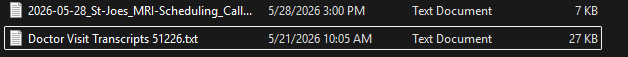
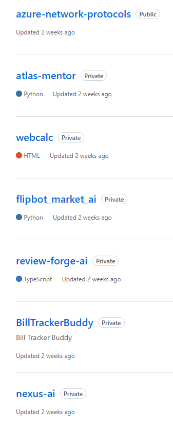
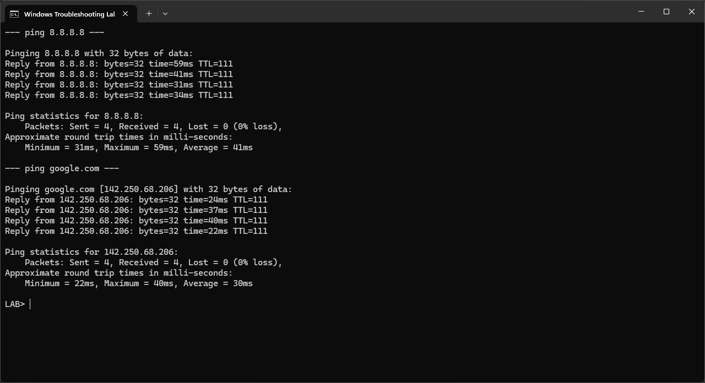
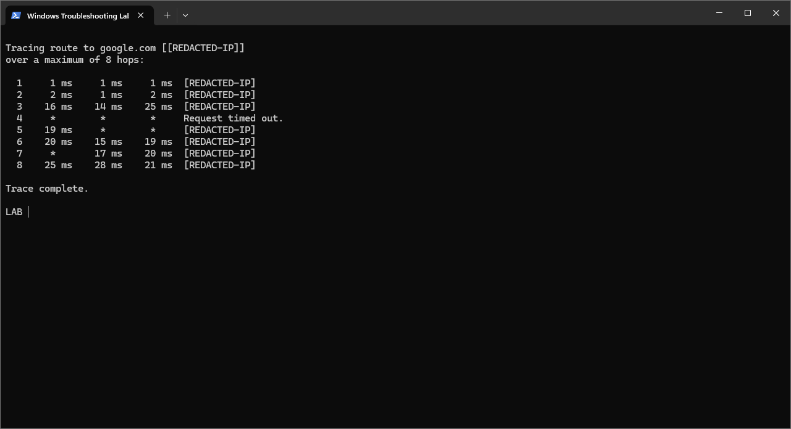
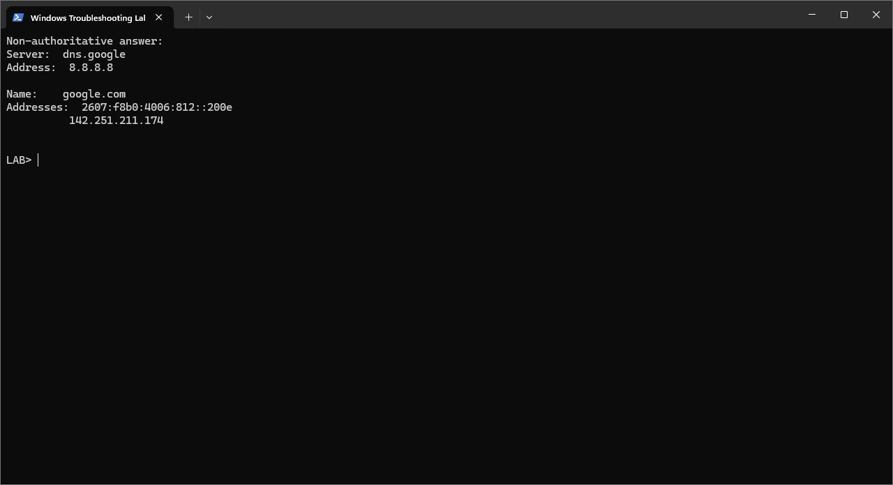
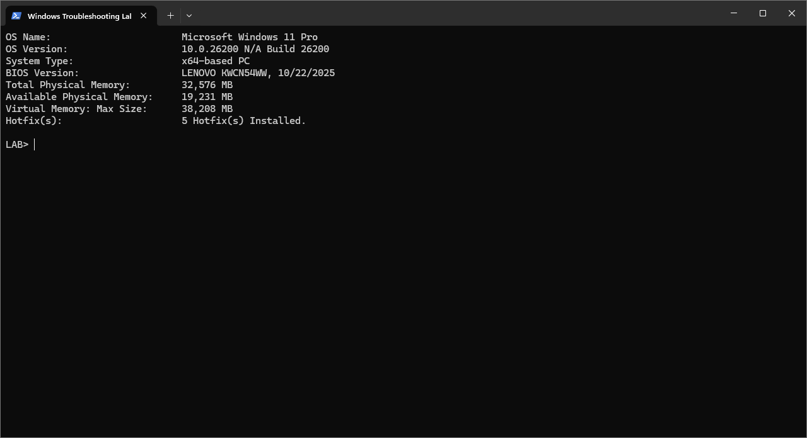
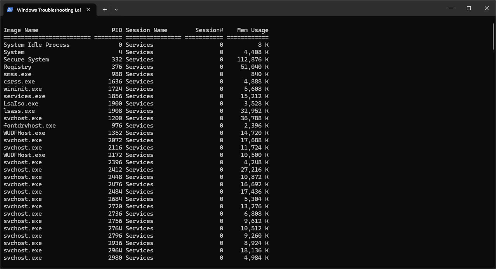
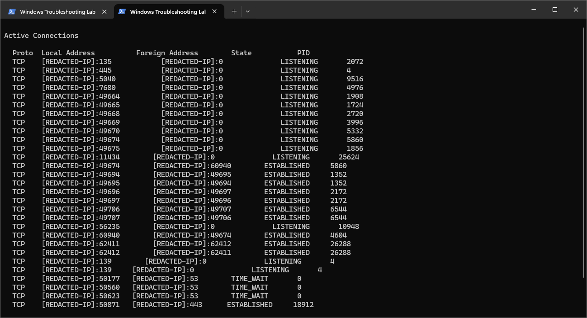

# Windows Command-Line Troubleshooting Lab

## Recruiter TL;DR

This portfolio lab demonstrates practical Windows command-line troubleshooting for help desk, IT support, remote support, and junior sysadmin roles. It shows real diagnostic commands, privacy-cleaned output files, screenshot-backed proof, and short support explanations for common troubleshooting workflows.

> Full case study: [case-study.md](case-study.md) | Resume bullets: [resume-bullets.md](resume-bullets.md)

---

## Business Scenario

A remote support technician needs to gather clear evidence from a Windows workstation before escalating a connectivity, DNS, performance, or system-support issue.

This lab simulates that workflow using common Windows command-line tools:

- Network configuration review
- Internet connectivity testing
- DNS troubleshooting
- Route/path testing
- System inventory review
- Running process review
- Active network connection review
- Privacy-conscious documentation

---

## Tools Used

| Tool | Purpose |
|---|---|
| Windows Command Prompt | Ran real troubleshooting commands and captured support evidence. |
| PowerShell | Helped clean output files, organize screenshots, and manage Git workflow. |
| ShareX | Captured consistent terminal screenshots for portfolio evidence. |
| Git / GitHub | Version control, documentation, and public portfolio presentation. |

---

## Screenshot Walkthrough

### 1. Network Configuration Reviewed with `ipconfig /all`

What was completed:
Captured `ipconfig /all` output from a Windows workstation and redacted sensitive host, IP, MAC, gateway, DHCP, DNS, and IPv6 details before publishing.

What this proves:
Shows the ability to review adapter configuration, DHCP status, gateway information, DNS settings, and network details while protecting private system information.

Output file: [command-outputs/ipconfig-output.txt](command-outputs/ipconfig-output.txt)

---

### 2. Internet Connectivity Tested with `ping 8.8.8.8`

What was completed:
Ran a ping test against Google public DNS to confirm the workstation could reach an external IP address.

What this proves:
Shows a basic connectivity check that does not depend on DNS name resolution, which helps separate internet access issues from DNS issues.

Output file: [command-outputs/ping-output.txt](command-outputs/ping-output.txt)

---

### 3. DNS Name Connectivity Tested with `ping google.com`

What was completed:
Ran a ping test against `google.com` after confirming external IP connectivity.

What this proves:
Shows that DNS name resolution and internet connectivity are both working. If `ping 8.8.8.8` worked but `ping google.com` failed, that would point toward a DNS problem.

Output file: [command-outputs/ping-output.txt](command-outputs/ping-output.txt)

---

### 4. Network Route Reviewed with `tracert google.com`

What was completed:
Captured a route trace to `google.com` and redacted public or local IP address details before publishing.

What this proves:
Shows the ability to review the path traffic takes to a destination and identify where timeouts or routing issues may appear during troubleshooting.

Output file: [command-outputs/tracert-output.txt](command-outputs/tracert-output.txt)

---

### 5. DNS Resolution Tested with `nslookup google.com`

What was completed:
Ran `nslookup google.com` using a public DNS server and captured the resolved DNS response.

What this proves:
Shows the ability to test whether DNS can resolve a domain name and confirm that name resolution is working independently from general ping testing.

Output file: [command-outputs/nslookup-output.txt](command-outputs/nslookup-output.txt)

---

### 6. Safe System Inventory Captured with `systeminfo`

What was completed:
Captured a privacy-cleaned subset of `systeminfo` output, including Windows version, system type, memory, virtual memory, and hotfix count.

What this proves:
Shows the ability to collect useful system inventory details for escalation without publishing sensitive device identifiers such as host name, BIOS details, registered owner, or product ID.

Output file: [command-outputs/systeminfo-output.txt](command-outputs/systeminfo-output.txt)

---

### 7. Running Processes Reviewed with `tasklist`

What was completed:
Captured a list of running Windows processes from CMD.

What this proves:
Shows process-awareness for basic performance, application, and support triage. This is useful when checking whether an application or background process is running.

Output file: [command-outputs/tasklist-output.txt](command-outputs/tasklist-output.txt)

---

### 8. Active Connections Reviewed with `netstat -ano`

What was completed:
Captured `netstat -ano` output and redacted IP address details before publishing.

What this proves:
Shows the ability to review active network connections, listening ports, connection states, and process IDs while protecting private network information.

Output file: [command-outputs/netstat-output.txt](command-outputs/netstat-output.txt)

---

## Project Files

| Folder / File | Purpose |
|---|---|
| [command-outputs/](command-outputs/) | Privacy-cleaned command outputs used as evidence. |
| [screenshots/](screenshots/) | Screenshot walkthrough images shown in this README. |
| [troubleshooting-notes/](troubleshooting-notes/) | Short notes explaining what each command checks and why support technicians use it. |
| [case-study.md](case-study.md) | Hiring-manager style project case study. |
| [resume-bullets.md](resume-bullets.md) | Resume-ready project bullets and summary language. |
| [linkedin-post.md](linkedin-post.md) | LinkedIn-ready project announcement draft. |

---

## Skills Demonstrated

- Windows command-line troubleshooting
- Network configuration review
- Internet connectivity testing
- DNS troubleshooting
- Route/path testing
- System inventory review
- Running process awareness
- Active network connection awareness
- Privacy-conscious documentation
- Technical writing for support workflows
- Git / GitHub portfolio documentation

---

## Interview Talking Points

- I used real Windows diagnostic commands and documented what each one proves in a support context.
- I captured screenshot-backed proof instead of only listing commands.
- I redacted private system and network details before publishing.
- I used CMD for the troubleshooting workflow and PowerShell/Git for documentation automation.
- This project demonstrates how I gather evidence before escalating an issue instead of guessing.

---

## Privacy Note

This project uses real Windows command-line output, but sensitive details were removed or avoided before publishing. Redacted items include host names, usernames, computer names, MAC addresses, local IP addresses, IPv6 addresses, gateway details, DHCP details, DNS details, BIOS/device identifiers, product IDs, and other private system details.

---

## Related Training

This lab reinforces foundational support skills from the Google IT Support Professional Certificate, including Windows troubleshooting, command-line diagnostics, operating system concepts, and structured problem solving.

---

## Status

Screenshot-backed complete.
